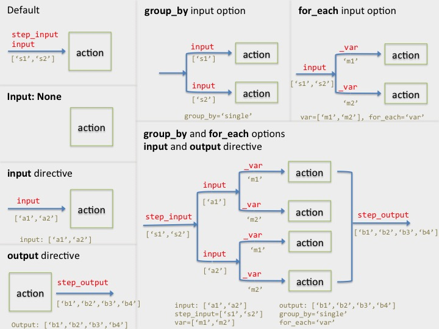

<!-- START doctoc generated TOC please keep comment here to allow auto update -->
<!-- DON'T EDIT THIS SECTION, INSTEAD RE-RUN doctoc TO UPDATE -->
**Table of Contents**  *generated with [DocToc](https://github.com/thlorenz/doctoc)*

- [File header](#file-header)
  - [shebang and file format lines](#shebang-and-file-format-lines)
  - [Workflow descriptions](#workflow-descriptions)
- [Literals and variables](#literals-and-variables)
  - [String literal](#string-literal)
  - [List literal](#list-literal)
  - [SoS variables](#sos-variables)
  - [Expressions with SoS variables](#expressions-with-sos-variables)
  - [String interpolation](#string-interpolation)
- [Global variables](#global-variables)
- [Command line options](#command-line-options)
- [Workflow definitions](#workflow-definitions)
  - [Define a single workflow](#define-a-single-workflow)
  - [Define multiple workflows](#define-multiple-workflows)
  - [Shared steps between workflows](#shared-steps-between-workflows)
  - [Execution of a subset of steps](#execution-of-a-subset-of-steps)
- [Workflow step](#workflow-step)
  - [step options](#step-options)
  - [Description of step](#description-of-step)
  - [Runtime variables](#runtime-variables)
  - [Input files (`input:`)](#input-files-input)
  - [Input options](#input-options)
    - [Passing input files all at once (default)](#passing-input-files-all-at-once-default)
    - [Passing files of allowed type (option `filetype`)](#passing-files-of-allowed-type-option-filetype)
    - [Passing files in groups (option `group_by`)](#passing-files-in-groups-option-group_by)
    - [Attaching variables to input filenames (option `labels`)](#attaching-variables-to-input-filenames-option-labels)
    - [Looping through values of a SoS variable (Option `for_each`)](#looping-through-values-of-a-sos-variable-option-for_each)
    - [Conditional skip of a step (option `skip`)](#conditional-skip-of-a-step-option-skip)
  - [Dependent files (`depends` (or called `dependent`?))](#dependent-files-depends-or-called-dependent)
  - [step actions](#step-actions)
- [Auxiliary workflow steps and makefile style dependency rules](#auxiliary-workflow-steps-and-makefile-style-dependency-rules)

<!-- END doctoc generated TOC please keep comment here to allow auto update -->

Although many items can be ignored, a typical SoS script has the following format:

```python
#!/usr/bin/env sos-runner
#fileformat=SOS1.0
#
# Other overall comments such as
#    License
#    change log
#

# Description of the workflows defined in
# script

# workflow1
# Description of workflow1

# workflow2
# Description of workflow2
#

# global variables
var1=value1
var2=value2
...

[parameters]
# comment 1
par1=default1
   
# comment 2
par2=default2

[step1: options]
step1 input, variables, and actions

[step2: options]
step2 input, variables, and actions
```

## File header
### shebang and file format lines

A SoS script usually starts with lines

```python
#!/usr/bin/env sos-runner
#fileformat=SOS1.0
```

The first line allows the script to be executed by command `sos-runner` if it is executed as
an executable script. The second line tells SoS the version of the script. The `#fileformat` 
line does not have to be the first line but should be in the first comment block.

Other lines in the first comment block are ignores.

### Workflow descriptions

The following comment blocks are description of workflows defined in the script. The description
is considered to be related to a particular workflow if it starts with only the name of the workflow
in the first line. These descriptions would be displayed in the output of command `sos view script`.

## Literals and variables 

SoS uses [Python](http://www.python.org) syntax for literals and variables with some minor modifications. 

### String literal

* Strings are quoted text. You can use `' '`, `" "`, `''' '''`, and `""" """` to quote your text. Different quotation styles allows you to quote string with another string quotation character (e.g. `"Letter 'a'"`).
* Backslash can be used to enter special characters (e.g. '\n'). Instead of using python raw string prefix (e.g. `r'raw \n'`), **SoS automatically treats string quoted by `' '` and `''' '''` as raw strings**. If you are uncertain what this means, always use single quotation marks.

### List literal

SoS only supports list of strings so a list literal would have form

```
['a', 'b']
```

where comma separated strings are enclosed by `[` and `]`.

### SoS variables

SoS variables are case-sensitive python variables associated with the execution of SoS scripts. For simplicity, they can only be **string** or **list of strings**. They can be defined almost anywhere in a SoS script.

For example

```python
resource_path = '/path/to/resource'
sample_names = ['sample1', 'sample2']
```

defines two variables `resource_path` (a string) and `sample_names` (a list).

### Expressions with SoS variables

Any python expressions involving any SoS variables and defined functions can be used in SoS scripts. For example

* `input[0]` gets the first input file
* `os.path.basename(input[0])` get the base name of input file
* `[x for x in input if '_R1_' in x]` returns all files with `_R1_` in its names
* `output_dir + '/' + input[0] + '.bai'` return a file under `output_dir` with `.bai` appended to filename.
* `os.path.getsize(input[0])` return a string (converted from integer) of file size
* `os.path.getsize(input[0]) > 0` return `True`
* `os.environ['MY_VAR']` return the value of environment `MY_VAR`.
* `glob.glob('*.txt')` return a list of files with extension `.txt` under the current directory.

Note that SoS makes available modules `glob`, `os`, `sys`, and more modules can be imported with workflow action.

### String interpolation

On top of python string manipulation functions and similar to recently introduced (Python 3.6) format string, SoS uses string interpolation to replace variables and expressions within a string with their values. For example

```python
ref_genome = '${resource_path}/hg19/refGenome.fasta'
title = 'Sample ${sample_names[0]} results'
all_names = 'Samples ${sample_names}'
```

Here the value of variable `resource_path` and expression `sample_names[0]` are replaced with their values when they are quoted between `${` and `}` in a string literal. List of strings will be automatically conerted to a string by joining strings with a space so `${sample_names}` will be expanded to `sample1 sample2`.

You can continue to use Python string functions such as

```python
ref_genome = resource_path + '/hg19/refGenome.fasta'
title = 'Result for the first sample {} is invalid'.format(sample_names[0])
```

but string interpolation is recommended for large scripts because it is easier to use.

Because a SoS script can include scripts in different languages with different sigils (special characters used to enclose expression), **SoS allows the use of different sigils** in the script. Whereas the default sigil (`${ }`) has to be used for global variables, other sigils can be used for different sections of the script. For example

```python
[step_10: sigil=`%( )`]
title = 'Sample %(sample_names[0]) results'

run('''
for file in *.fastq
do
    echo Processing ${file} ...
    echo %(title)
done
```

uses a different sigil style because the shell script uses `${ }` so `${file}` keeps its meaning in the shell script while `%(sample_names[0])` and `%(title)` are replaced by SoS to their values.

## Global variables 

Before the definition of any section (in the format of `[section_name: options]`, you can define arbitary number of global variables. These are usually constant string variables such as pathes to various resources, but can also be derived values from command line options (see next section).

In addition to user-defined global variables, SoS defines the following variables

* `workflow_name` (constant string): name of the workflow being executed
* `sos_version` (constant string): version of sos
* `home` (constant string): home directory
* `workdir` (string): full path to the current working directory

## Command line options

SoS looks for a `[parameters]` section for command line options and their default arguments. The format of each variable is 

```
# comment
var_name=default_value
```

The default value can be string, list of string, or expressions that return string or list of string. For example

```
# path to tool gatk
gatk_path='~/bin/GATK'
```

defines a variable `gatk_path` with default value `'~/bin/GATK'`. 

```
# A list of sample names
sample_names=[]
```

defines a variable `sample_name` with default value `[]`. And

```
# A list of sample names
gatk_path=config('gatk_path', config_file='~/.sos_config')
```

calls a function `config` to get the value of `gatk_path` from a configuration file.

The comments before variable definition are meaningful because they will appear in the help message of the script (`sos show script`). 
The default values not only determines the values of variable when they are not specified from command line, but also determines
the type of input these parameters accept.

For example, with the above definitions for command arguments `--gatk_path` and `sample_names`, you can pass values to 
these variables from command line, 

```bash
sos run myscript.sos --gatk_path /path/to/gatk --sample_names A1 A2 A3
```

A list will be passed to `sample_names` even if only a single value is provided (e.g. `sample_names=['A1']` for `--sample_name A1`).
Attempts to pass more than one values (a list) to `gatk_path` (e.g. `--gatk_path /path1 /path2`) will trigger an error.

## Workflow definitions

A SoS script can specify one or more workflows. Each workflow consists of one or more numbered steps. The numbers specify the **logical order** by which the steps are executed, but a later step might be executed before the completion of previous steps if it does not depend on the output of these steps.

### Define a single workflow

A single pipeline can be specified without a name in a SoS script. For example, the following sections specify a pipeline with four steps `0`, `10`, `20`, and `100`. As you can see, the workflow steps can be specified in any order and do not have to be consecutive (which is actually preferred because it allows easy insertion of extra steps).

```
[0]
[20]
[10]
[100]

```

Workflows specified in this way is the `default` step and actually called `default` in SoS output. If you want to give it a meaningful name, you can specify the steps as 

```
[mapping_0]
[mapping_20]
[mapping_10]
[mapping_100]
```

Because the SoS script defines only one workflow, yo do not have to specify the name of workflow from SoS command 

```bash
sos run myscript.sos --input input1.fasta
```

Unnumbered workflow steps such as `parameters` have their own uses and are not part of a workflow.

### Define multiple workflows 

A SoS script can define multiple workflows. For example, the following sections of SoS script defines two workflows named ``mouse`` and ``human``.

```
[mouse_10]
[mouse_20]
[mouse_30]
[human_10]
[human_20]
[human_30]
```

You will have to specify which workflow to execute from the command line, e.g.

```bash
sos run myscript mouse --input input1.fasta
```

If you would like to define a ``default`` and a named workflow, you can define them as

```
[10]
[20]
[30]
[test_10]
[test_20]
[test_30]
```

The `default` workflow will be executed by default using command

```bash
sos run myscript.sos --input input1.fasta
```

The `test` workflow will be executed if its name is specified from the command line

```bash
sos run myscript.sos test --input input1.fasta
```

### Shared steps between workflows

The most common motivation of defining multiple workflows in a single SoS script is that they share certain processing steps. If this is the case, you can define sections such as

```
[mouse_10,human_10]
[mouse_20]
[human_20]
[mouse_30,human_30]
```

or

```
[*_10]
[mouse_20]
[human_20]
[*_30]
```

or

```
[*_10]
[mouse_20,human_20]
[fly_20]
[*_30,fly_50]
[fly_40]
```

In the last case, step defined by `[*_30,fly_40]` will be expanded to ``mouse_30``, ``human_30``, ``fly_30``, and ``fly_50`` and will be executed twice for the `fly` workflow.

### Execution of a subset of steps

Although workflows are usually executed in its entirety, there are cases where you would like to execute only a subset of steps. For example, you can execute step 10 of the pipeline mouse using command

```bash
sos run myscript.sos mouse:0
```

Similarly, you can execute step 10 of the default workflow, up to step 20 of workflow `mouse``, steps 10 and 20 of workflow `mouse`, and step 20 and later of workflow `mouse`, respectively, using the following comands

```bash
sos run myscript.sos :10
sos run myscript.sos mouse:-20
sos run myscript.sos mouse:10,20
sos run myscript.sos mouse:20-
```

## Workflow step

Although only a *step action* is required for a SoS step, a complete SoS step can have the following form

```
[name_step: option1, option2, ...]
#
# description of the step
#
key0=value0

input:
    input files, opt1=value1, opt2=value2

depends:
    dependent files

output:
	output files

key1=value1
key2=value2

step_action

key3=value3
key4=value4

```

The following figure summarizes the effect of section option `no_input`, `input`
and `output` directives and input options `group_by` and `for_each` on the flow
of input and output files and related variables:




### step options

**Step options** are specified after step name and controls how the step will be executed. SoS provides the following options

* **`skip`**: the whole step will be skipped as if it is not defined at all in the script. This option provides a quick method to disable a step.
* **`no_input`**: this step does not need any input so it is a **root** of the execution tree. This option disconnects the current step with its previous steps so that it can be
    executed before the completion of previous steps. 
* **`terminal`**: this step is one of the **terminals** or **leafs** of the execution tree. This allows the later steps to be
   executed before the completion of this step. The step can have output but no other step should depend on these output
   files.
* **`nonconcurrent`**: if the step action will be repeated (using input options `group_by` or `for_each`), the loop actions are assumed to be parallel executable.
  If for some reason this assumption is wrong, you can set option `nonconcurrent` to let the actions execute sequentially.  
* **`blocking`**: the step can only be executed by one instance of SoS. All other SoS instances will wait until one instance complete this step. This option should be used for actions such as the creation of index and downloading of resources.
* **`sigil`**: alternative sigil of the step, which should be a string with space. E.g. `sigil='[ ]'` allows the use of expressions such as
  `[input]` in this step.
* **`target`**: target filename that will trigger an [auxillary step](sos_format_v1.md#auxiliary-workflow-steps-and-makefile-style-dependency-rules).

### Description of step
The first comment block after the section head (`[]`) is the description of the section and will be displayed in the output of command `sos show script`.

### Runtime variables

Variables can be defined and used freely in a step. Depending on the location where the variables are defined, they can be classified as

* **Pre-input variables** (string or list of strings): variables defined before `input:`.
* **Pre-action variables** (string or list of string): variables defined after `input:` and before action. They will be evalulated with each `input`.
* **Post-action variables** (string or list of strings): variables defined after the execution of step action.

Because variables pass information from one step to another and dictates how actions are executed. It is important to understand how variables are defined and used in a SoS step.

* Before entering the step:
  * **`step_index`** (string) is defined automatically to the index of the current step 
  * **`step_input`** (list of strings): input from the last completed step, or `[]` if step option `no_input` is set.

* **Pre-input varialbes** will be defined before the processing of input files. It is possible to redefine `step_input` here.
 
* The `input:` specification generates the following variables:
  * **`input`** (list of strings): selected input files. Depending on input options, step action might be executed multiple times with different set of `input` files. 
  * **file label variables** (list of strings): Labels of files in `input` if `labels` option is defined.
  * **loop variables** (string): value of loop variables if `for_each` option is defined 

* **Pre-action variables** will be defined and used. They will be defined multiple times if the step action will be executed with different `input` etc.

* Step action generates output files. The output files are specified by **`output`** and are saved as variable **`step_output`**

* **Post-action variables** will be defined after the exeuction of step action. It can be used to redefine `step_output` (e.g. remove duplicate output files from action output).


The following sections will provide plenty of examples on how to use these variables. As the two most frequently used cases, step variables can be used to give informative names (aliases) to the input and output of the step so that they can be used in later steps with proper names.

For example

```python
[100]
raw_reads = step_input

run(''' action to align fasta files''', output=...)

aligned_reads = step_output

[150]
# do something else to raw reads (e.g. quality control report)
input: raw_reads
run(''' ... ''')

[200]
# process aligned reads
input: aligned_reads
run(''' ... ''')
```


### Input files (`input` directive)

The input of SoS step follows the following rules:

1. **the input of a SoS step is by default the output of the previous step**.
3. **step option `no_input` specifies that no input file is needed for the current step**
4. **Input of a step can be specified by item `input`**, which should be a list or tupe of either 
    filenames (quoted strings) or SoS variables (use names of variables).  Wildcard characters
	(`*` and `?`) are always expanded. 

Examples of input specification are as follows:

```
input:
	'file1.fasta', 'file2.fasta'

input:
    'file*.fasta', 'filename with space.fasta'
    
input:
    'file*.txt',
    'directory/file2.txt'
   
input:
    aligned_reads

input:
    aligned_reads, reference_genome

input:
    aligned_reads[2:]

input:
    glob.glob('*.fastq')

```

It does not matter if `aligned_reads` and `reference_genome` are lists of filenames. SoS will expand wildcard characters and flatten the lists to a single list of filenames.

Of special interest is the use of functions such as `glob.glob` to determine input files. This can be very useful for pipelines that, for example, regularly scan a directory and process unprocessed files. However, because the value of this step depends on availability of files, the output of `sos show script` and the executation path will be unpredictable, and even wrong if there is no available file during the execution of `sos show script`.

### Input options 

The input options of a SoS step control how input files are passed to the step action. To should be keyword arguments appended to list
of input files.

#### Passing input files all at once (default)

This is the default action for a SoS step. That is to say, action in the following step will get all 
`input_files` as its input (variable `input`) to step action.

```
[step]
input:
    input_files

run('echo ${input}')

```

#### Passing files of allowed type (option `filetype`)

Emission options are appended to input file list as comma separated lists. A python parameter syntax is required.

Option `filetype` accepts one or more filetypes (file extension with `.`) or a lambda function. For example,

```
[step]
input:
	input_files, filetype='.fastq'
	
```

passes only files with extension `.fastq`.


```
[step]
input:
	input_files,
	filetype=['.fastq', '.fastq.gz']
	
```

passes only files with extension `.fastq` or `.fastq.gz`.


```
[step]
input:
	input_files,
	filetype=lambda x: open(x).readline().startswith('##fileformat=VCF4.1')
	
```

passes only files with the first line starting with string `##fileformat=VCF4.1``. Here the value of the parameter is a lambda function that will be passed to each input filename.


#### Passing files in groups (option `group_by`)

Option `group_by` pass input files in groups. For example,

```
[step]
input:
	'file1', 'file2', 'file3', 'file4',
	group_by='single'

run('echo ${input}')

```

will execute `run('echo ${input}')` four times, with `input` set to `['file1']`, `['file2']`, `['file3']` and `['file4']` respectively.

Other values of `group_by` includes

* `'pairwise'`: yields two groups `['file1', 'file2']`, `['file2', 'file3']`, and `['file3', 'file4']`.
* `'combinations'`: yields six groups `['file1', 'file2']`, `['file1', 'file3']`,  `['file1', 'file4']`, `['file2', 'file3']`, `['file2', 'file4']` and `['file3', 'file4']`.
* ``pairs``: yields `['file1', 'file3']` and `['file2', 'file4']`. It basically split the input files in half and match files in the first half with files in the second half.

for four input files. Obviously, the output of the `pairs` cases depends on the order of files. If you need to pair files in any particular order, you can control it in input. For example

```
[step]
input:
	sorted([x for x in fastq_files if '_R1_' in x]),
	sorted([x for x in fastq_files if '_R2_' in x]),
	group_by='pairs'

run('echo ${input}')

```

will take all input files and sort them by `_R1_` and `_R2_` and by filename. For example, four files
`FEB_R1_1.txt FEB_R2_2.txt FEB_R1_2.txt FEB_R2_1.txt` will be sorted as
`FEB_R1_1.txt FEB_R1_2.txt FEB_R2_1.txt FEB_R2_2.txt` and be sent to step
action in two groups `['FEB_R1_1.txt', 'FEB_R2_1.txt']` and `['FEB_R1_2.txt', 'FEB_R2_2.txt']`.

#### Attaching variables to input filenames (option `labels`)

There are cases where the command line options or output directories depends on input filename. SoS allows you to label each filename with one or more variables so that they can be used accordingly. For example, if you have input files `bam_files` with values

```python
bam_files = ['case/A1.bam', 'case/A2.bam', 'ctrl/A1.bam', 'ctrl/A2.bam']
```

You might want to define some derived variables such as

```python
mutated = [x.split('/')[0] for x in bam_files]
sample_name = [os.path.basename(x).split('.')[0] for x in bam_files]
```

with values

```python
mutated = ['case', 'case', 'ctrl', 'ctrl']
sample_name = ['A1', 'A2', 'A1', 'A2']
```

Then, if you are processing these files individually, or in pairs, you can attach values of these derived variables as follows:


```
[step]
input:
	bam_files,
	group_by='pairs', labels=['mutated', 'sample_name']

run('process ${input} with variables ${_mutated} and ${_sample_name}')

```

Here `bam_files` will be passed in pairs with file labels set to variables with `_` prefixed to their names. More specifically,

* Group1: `input = ['case/A1.bam', 'ctrl/A1.bam']`, `_mutated=['case', 'ctrl']`, `_sample_name=['A1', 'A1']`
* Group2: `input = ['case/A2.bam', 'ctrl/A2.bam']`, `_mutated=['case', 'ctrl']`, `_sample_name=['A2', 'A2']`

This is equivalent to

```
[step]
input:
	bam_files,
	group_by='pairs'

_mutated = [x.split('/')[0] for x in input]
_sample_name = [os.path.basename(x).split('.')[0] for x in input]

run('process ${input} with variables ${_mutated} and ${_sample_name}')

```

but it is cleaner because you do not have to do this each time when `bam_files` is used.

#### Looping through values of a SoS variable (Option `for_each`)

Option `for_each` allows you to repeat step actions for each value of a variable. For example, if

```python
method=['method1', 'method2']
```

You can repeat the analysis with each method using

```
[step]
input:
	bam_files,
	for_each='method'

run('Analyze ${input} with method ${_method}')

```

The step action will be executed twice with value of parameter `_method` set to `'method1'` and `'method2'` respectively.

Nested loops are also allowed. For example, if

```python
method=['method1', 'method2']
parameters=['-5', '-9']
```

You can execute 

```
[step]
input:
	bam_files,
	for_each=['method', 'parameter']

run('Analyze ${input} with method ${_method} and parameter ${_parameter}')

```

with parameters

* `_methods='method1', _parameter='-5'`
* `_methods='method1', _parameter='-9'`
* `_methods='method2', _parameter='-5'`
* `_methods='method2', _parameter='-9'`

If you would like to loop the action with several parameters, you can put them into a the same level using

```
[step]
input:
	bam_files,
	for_each='method,parameter'

run('Analyze ${input} with method ${_method} and parameter ${_parameter}')

```

The action will then be executed twice with parameters

* `_methods='method1', _parameter='-5'`
* `_methods='method2', _parameter='-9'`

Finally, option `for_each` assumes that the steps can be executed independently and concurrently and will
try to execute the actions in parallel if the script is executed in parallel mode (option `-j`). If for some
reason this assumption is wrong and the step needs to be executed sequentially, you should use the
`nonconcurrent` section option to execute loop actions sequentially.


#### Conditional skip of a step (option `skip`)

Option `skip=True` will make SoS skip the execution of the current step. Using `skip=True` is not very useful so this option is often used with a SoS variable. For example

```python
[10]
input:
	fasta_files,
	skip=len(fasta_failes) == 1
	
run('command to merge multiple fasta files.')
```

Here the `skip` option gets the value of `True` if there is only one input file. The command to merge multiple input files would then be skipped.

One important detail of this option is that the step is actually **executed with a null action** that passes input files to output files
so this step still yields its `step_output`. In comparison, a step is completely ignored if it has step option `skip`. The consequence
of this rule for this particular example is that its next step would get a merged file if there are multiple input files, or
the original file if there is only a single input file.

### Dependent files (`depends` (or called `dependent`?))

This item specifies files that are required for the step. Although not required, it is a good practice to list resource files and other dependency files for a particular step. For example

```python
[10]
input:
	fasta_files
	
depends:
	reference_seq
	
```

Note that dependent files are processed after input files so variable `input` and others are available to use for `depends`. 

### Step output files (`output` directive)

Output files of a step can be specified by item `output`. Whereas `input` is a directive to overide or 
change SoS provided variable `step_input` to produce one or more variable `input`, the `output` is a
directive to specify `step_output` which should be the collection of all output files if step action is executed
multiple times.


```python
[10]
input:
	fasta_files
	
depends:
	reference_seq

output:
	'output/aligned.bam'

```


### step actions

Please refer to [step actions](actions.md) for details

## Auxiliary workflow steps and makefile style dependency rules

Auxiliary steps are special steps that are used only when a target is needed but not available. Such steps are defined in the format of

```python
[step_name_without_index : target=pattern]

step_input = expression involving step_output

input:
depends:
action()

```

where

* Step name does not have an index.
* An option `target` specifies that pattern of files that triggers the step.
* There is no `output` directive.
* `step_input` should be explicitly calculated from a SoS provided `step_output`

For example,

```python
[index_bam : target='*.bam.bai']
#
# index bam file if its index is needed

# input file should be filename.bam if the output is filename.bam.bai
step_input = [x[:-4] for x in step_output]

input: group_by='single'

# create ${input}.bai from ${input}
run('samtools index ${input}')

```

defines a step called `index_bam`. When a file with extension `*.bam.bai` is required but does not exist,
for example when the following step

```python
[align_100]

depends: input[0] + '.bai'
...

```

is executed with input `['A1.bam']`, SoS will check if there is an auxillary step to produce it and
call that step with `step_output=['A1.bam.bai']` but no `step_input`. In this example the `index_bam` step
will figure out what the input files are needed (`step_input=...`) and execute the step as a regular SoS step
if files specified by `step_input` exist.

You might have already realized that an auxiliary step is a makefile style step and you can use this technique to build completely 
workflows in a way similar to [snakemake](https://bitbucket.org/johanneskoester/snakemake). That is to say, you can define multiple
auxiliary steps (rules in snakemake's term) and let SoS determine what steps to execute depending on what workflow target to produce.
You can even mix the forward, input-oriented style with backward, output-oriented style in SoS. However, **auxiliary steps are
designed to be helper steps that could be called multiple times during the execution of a workflow**. If you are strongly inclined
to the makefile-like rule-based workflow system, make or snakemake should be better because they are specifically designed around
that paradigm.


